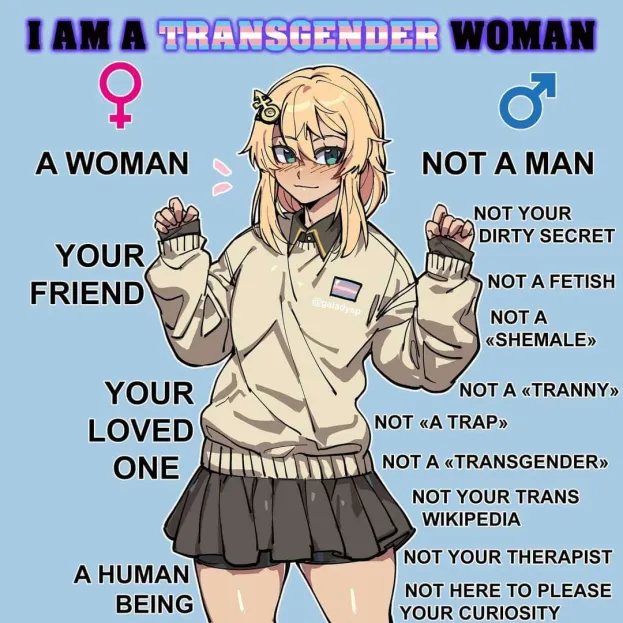
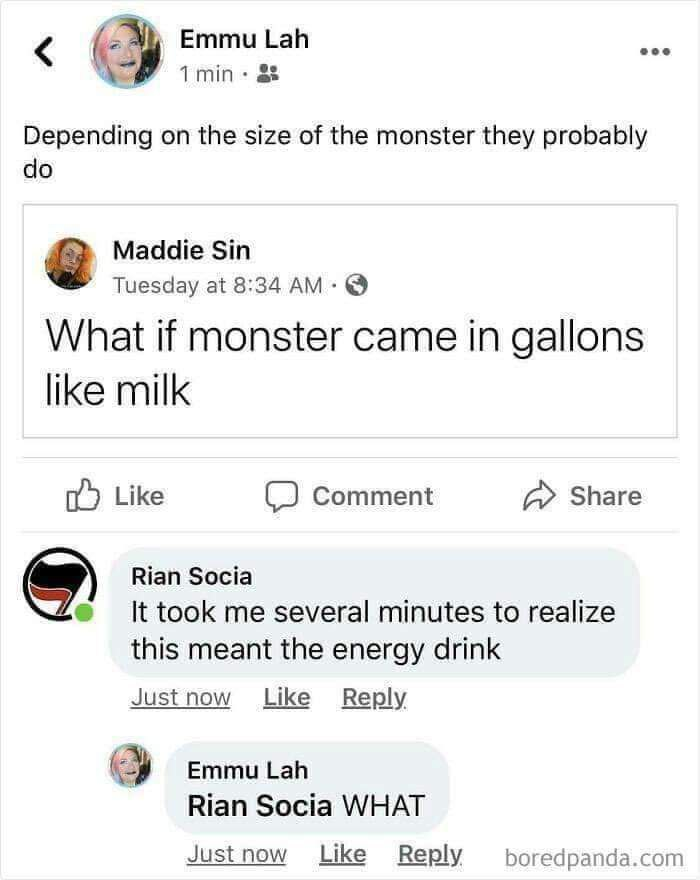

### "You have reached someone's profile."

> "From the middle of life onward, only he remains vitally alive who is ready to die with life. For in the secret hour of life's midday the parabola is reversed, death is born. The second half of life does not signify ascent, unfolding, increase, exuberance, but death, since the end is its goal. The negation of life's fulfilment is synonymous with the refusal to accept its ending. Both mean not wanting to live; not wanting to live is identical with not wanting to die. Waxing and waning making one curve."

Apparently it is customary for a profile to be <descriptive/informative>, what kind of person I am, what am I doing, that kind of stuff. But personally, I <find distasteful/withdraw from> such a idea because what could I tell you really? Light illuminates and blinds in equal measure. I myself could not claim a <complete/useful/accurate> <knowledge/understanding/connection> of myself. Whatever I could possibly <present/reveal/unconceal> to you will inevitably be a distorted <representation/simulation/abstraction>. But anyway, for your information, here are some descriptions about me, by me, in no particular order. Take them with a grain of salt, do not believe them but instead consider: What kind of individual would write them? You are <suggested/welcome> to <parley with/befriend> me <on social media/in real life> if you wish to know me better. 

- 🏳️‍⚧️Trans and Proud🏳️‍⚧️ I previously used the name "Sharon Cassidy", then ditched it because, come on, directly stealing a name like that is so unoriginal! So now I go by "Ashley" instead. Actually I have quite a few names I like (Call it a girl's vanity if you will), such as Adelaide, Heather, Claire, Ellie and of course Sharon. I wish I could use them all but imagine the confusion! So Ashley it is then (Actually, I also have a middle name, but only trusted friends know the initial, and the full name is going to be a top secret).
- [#ActuallyAutistic](https://twitter.com/search?q=%23actuallyautistic). I probably should elaborate, but I dunno, so let me just put a sub-list of some notable traits here:
    - Lot of unusual, fervent interests & _very_ quick learner for some topics.
    - Always interpret things literally.
    - "Uncanny" uncomfortableness around people except for close friends & need time alone to recover.
    - Can't really tolerate light.
    - Often retreat into my own mental space and won't come out, make weird facial expressions & sounds while I am at it.
    - Fidget a lot.
    - Instinctive resistance to asking for help.
    - Ambulate in a specific pattern wherever possible.
    - Reflexively try to find pattern in literally anything that repeats.
    - ...And many more.
- I was born in China Mainland, so my mother tongue is naturally Chinese, but I do speak English fluently (on par with a native speaker, I dare say). Also know a modest amount of Latin, and is very interested in this classical language (How many Computer Science students know Latin these days?). Also know a little [Ithkuil](https://en.wikipedia.org/wiki/Ithkuil), now _that_ is a rare and unusual language. Truly, I missed my calling as a linguist.
- When it comes to programming instead of human languages, I am proficient with: C/C++, Java, Kotlin, Python ("Proficient" defined as "Have written a-few-thousand-lines of-code projects"). I started out with Java (back in like, 2016. Oh boy, that was quite awhile ago), but C++ is my favorite now. Have an irrational aversion to Python somehow, typically only use it if I need to. 
- Avid amateur philosopher/psychoanalyst (As professional as someone who had read a lot of introductary books and only a few actual classic works can be). Post deranged theories/analyses on social media sometimes, even write full length articles sometimes. Truly, I missed my calling as a psychotherapist.
- Serious [Discordian](https://en.wikipedia.org/wiki/Discordianism) (The Wikipedia article does our great religion no justice, you are cordially invited to read the Principia Discordia and decide for yourself). "Serious" as in "Does not consider this whole endeavor to be just a parody to written off but as a legitimate source of inspiration". Also study Bible literature as a hobby.

Oh, here's a <meme/infographic> I like, I stole it from Twitter and could not locate the author, otherwise they're definitely getting the credit:

And here's a autism meme I relate to a lot, because I too didn't realize they're talking about the energy drink until I checked the comment section for the punch line.

<!--
**CascadingCascade/CascadingCascade** is a ✨ _special_ ✨ repository because its `README.md` (this file) appears on your GitHub profile.

Here are some ideas to get you started:

- 🔭 I’m currently working on ...
- 🌱 I’m currently learning ...
- 👯 I’m looking to collaborate on ...
- 🤔 I’m looking for help with ...
- 💬 Ask me about ...
- 📫 How to reach me: ...
- 😄 Pronouns: ...
- ⚡ Fun fact: ...
-->
